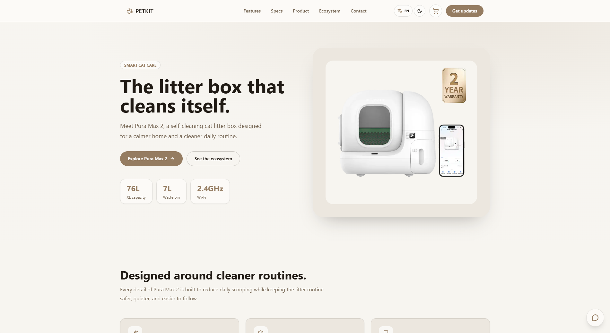
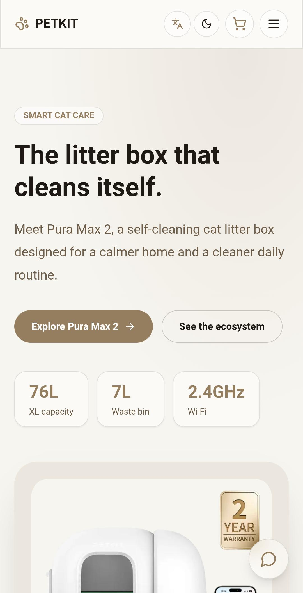
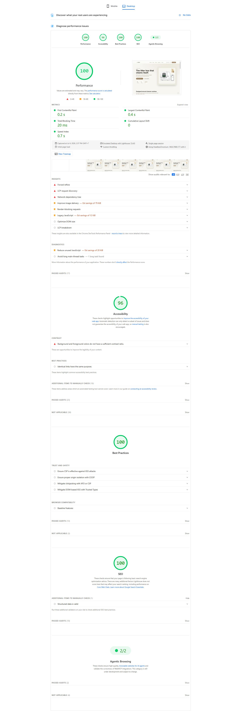
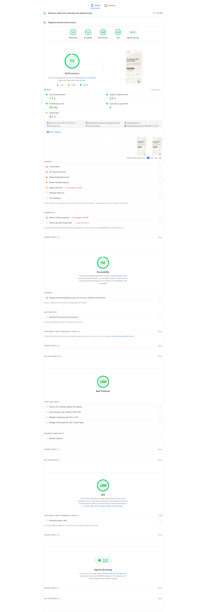

# PETKIT Smart Cat Care

Responsive PETKIT product experience built for the HeLiCorp IT Website Internship round 2 assessment.

## Links

- Repository: https://github.com/tranphuongkhoi/petkit_landingpage
- Production: https://helicorp-petkit.vercel.app
- PageSpeed: https://pagespeed.web.dev/analysis/https-helicorp-petkit-vercel-app/lc40ve4jxo

## Preview



<p>
  
</p>

## Overview

A PETKIT smart cat care storefront built around the Pura Max 2, featuring a landing page, product listing, product detail pages, comparison content, cart and saved-product interactions, bilingual UI, dark/light mode, and a floating product assistant.

## Features

- Responsive landing page with hero, features, technical specs, product family, ecosystem add-ons, and update form.
- Product listing and static product detail pages for PETKIT products.
- Product comparison tables grouped by product role.
- Cart drawer with saved quantity, price totals, and update request form.
- Saved products and recently viewed product context.
- English/Vietnamese toggle with component-scoped locale files.
- Dark/light mode with persisted preference.
- Server-side lead event route for n8n webhook delivery.
- Groq-powered PETKIT assistant grounded in project product data, cart items, and saved products.
- OpenRouter backup model support with Qwen and NVIDIA models when the primary Groq model is rate-limited.
- Vercel Web Analytics integration.
- SEO baseline with metadata, canonical URLs, `robots.txt`, and `sitemap.xml`.

## Tech Stack

- Next.js App Router
- React
- TypeScript
- Tailwind CSS
- Vercel Analytics
- n8n webhook integration
- Groq chat completion API
- OpenRouter chat completion fallback

## Local Development

```bash
npm install
npm run dev
```

Open http://localhost:3000.

## Environment Variables

Create `.env.local` from `.env.example`.

```bash
N8N_WEBHOOK_URL=
INTERNAL_TRACKING_SECRET=
GROQ_API_KEY=
GROQ_MODEL=
OPENROUTER_API_KEY=
OPENROUTER_MODEL_PRIMARY=qwen/qwen3-next-80b-a3b-instruct:free
OPENROUTER_MODEL_FALLBACK=nvidia/nemotron-3-nano-30b-a3b:free
```

`GROQ_MODEL`, `OPENROUTER_MODEL_PRIMARY`, and `OPENROUTER_MODEL_FALLBACK` are optional overrides. Local secrets and private notes are ignored by Git.

For Vercel, keep Groq as the primary provider and add only the OpenRouter fallback variables when needed:

```bash
OPENROUTER_API_KEY=
OPENROUTER_MODEL_PRIMARY=qwen/qwen3-next-80b-a3b-instruct:free
OPENROUTER_MODEL_FALLBACK=nvidia/nemotron-3-nano-30b-a3b:free
```

`ASSISTANT_PROVIDER=openrouter` is available for local fallback testing only. It should be left unset in Preview and Production so the assistant uses Groq first and falls back to OpenRouter only if needed.

## Verification

```bash
npm run lint
npm run typecheck
npm run build
```

## Routes

- `/`
- `/products`
- `/products/puramax-2`
- `/products/purobot-max-pro-2`
- `/products/purobot-crystal-duo`
- `/products/yumshare-solo`
- `/products/eversweet-max-2`
- `/robots.txt`
- `/sitemap.xml`

## Evidence

### Demo Video

<video src="https://res.cloudinary.com/dlvbs9ywm/video/upload/v1783166803/petkit-demo_qxsewy.mp4" controls width="720">
  Your browser does not support the video tag.
</video>

**Walkthrough**

| Time | What's happening |
|---|---|
| `0:00–0:10` | Trigger a test run of the n8n workflow |
| `0:10–0:15` | Successful test execution result in n8n |
| `0:15–0:45` | Clear cache/cookies for a clean run, switch to dark mode, browse the landing page in Vietnamese, then back to English |
| `0:45–0:50` | Product detail page |
| `0:50–0:55` | Save a product, shown under Saved + Recently Viewed |
| `0:55–1:00` | Add a different product to cart, open cart drawer (VND pricing, locale set to Vietnamese) |
| `1:00–1:13` | Open the assistant in English; its reply reflects the product currently being viewed and the cart contents |
| `1:13–1:35` | Switch product, ask the assistant what page is being viewed — it answers correctly and adds spec details |
| `2:05–3:35` | Ask the assistant to submit an update-request signup through the chat; it asks for name and email, tested mid-flow with a locale switch to confirm the reply language adapts |
| `3:02` | Fallback path: same event submitted directly through the landing page form |
| `3:35` | Submission reflected in the connected Google Sheet, including the page the user was on at submit time |
| `3:50` | Same test repeated from the cart, confirming the sheet also tracks submission source and scroll depth |
| `4:00–4:20` | Cache/cookies cleared again to retest the assistant-driven signup flow in Vietnamese |
| `4:22–end` | Name/email provided to the assistant, confirmed back before saving, verified in the sheet immediately after |

### Screenshots





## Notes

Pricing is presented as reference display data. Final availability, pricing, warranty, and distributor details can vary by market.
